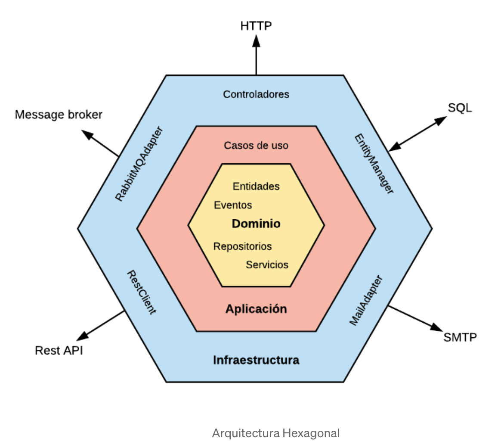

# Hexagonal



## Project
* **Description:** Hexagonal DDD archetype project oriented.
* **Version:** 0.0.1-SNAPSHOT

## How to run it?
IDE Main start
```
Run first 'docker-compose up' command in local-resources directory to start images
infrastructure/src/main/java/es/orquidea/hexagonal/bootstrap/SpringBootService.java
```

Command line plugin starter, run command into infrastructure module (hexagonal/infrastructure)
```
mvn spring-boot:run
```


## REST services

```
Get - http://localhost:8080/users/user/{userId}
Get - http://localhost:8080/users

Post - http://localhost:8080/users

Patch - http://localhost:8080/users

Delete - http://localhost:8080/users/user/{userId}
```

## GraphQL
* Main schema definition _infrastructure/src/main/resources/schema.graphqls_
* Configuration properties _infrastructure/src/main/resources/application.properties_
### Service
```
http://localhost:8080/graphql
```
### UI
```
http://localhost:8080/graphiql
```
Query example
```
{
  userById(id: "3740bf37-10b7-476b-8b3d-646a61e046f9") {
    id,
    name
    email
  }
}


```


### Documentation
* [Hexagonal Architecture](https://alistair.cockburn.us/hexagonal-architecture/)
* [Hexagonal Architecture (jmgarridopaz)](https://jmgarridopaz.github.io/content/hexagonalarchitecture.html#tc2-6)
* [Validation Spring Boot](https://www.baeldung.com/spring-boot-bean-validation)
* [Slf4j Config](https://mkyong.com/spring-boot/spring-boot-slf4j-logging-example/)
* [MongoDB embedded for Integration Test](https://www.baeldung.com/spring-boot-embedded-mongodb)
* [GraphQL](https://graphql.org/)
* [GraphQL Essentials example and UI](https://medium.com/@md.ali.azam/graphql-api-server-using-spring-boot-jpa-41ac1f6ad1c)
* [GraphQL Postman integration](https://learning.postman.com/docs/sending-requests/supported-api-frameworks/graphql/)

